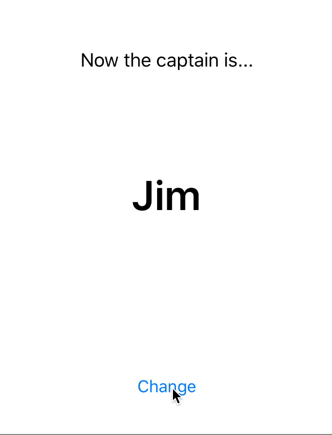
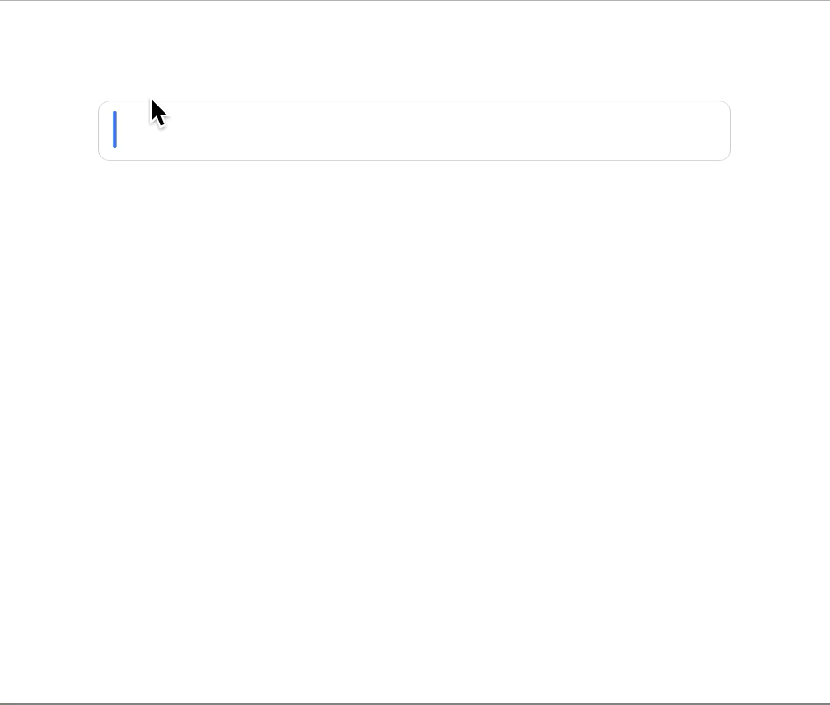
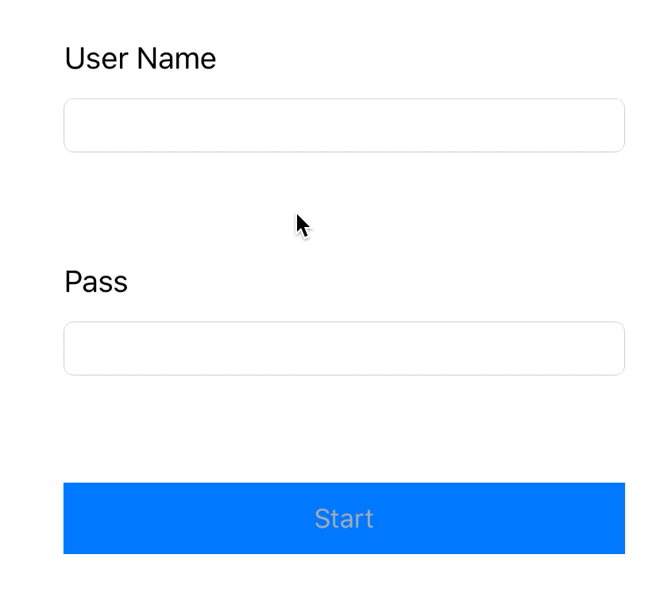
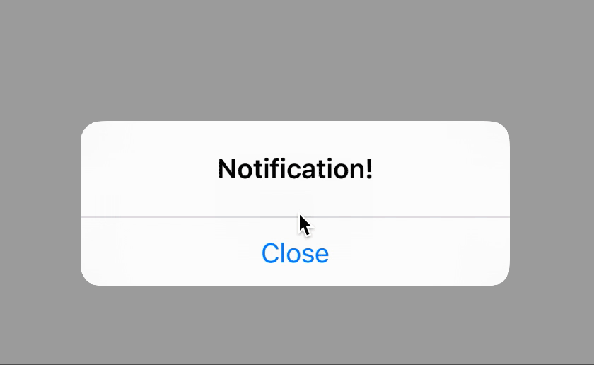
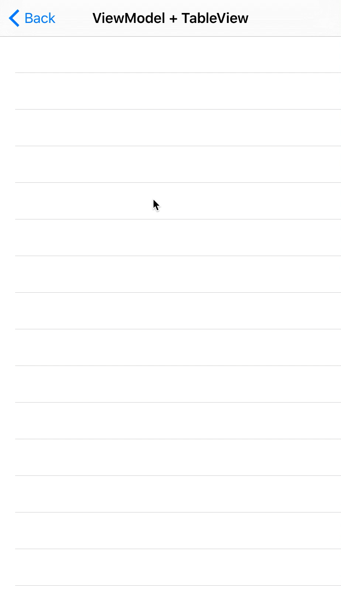

# SwiftBondSampler

[](https://developer.apple.com/iphone/index.action)
[](https://developer.apple.com/swift)

Simple code examples for [SwiftBond](https://github.com/SwiftBond/Bond)
- Bond v4.3.1
- Swift v2.2.1

## Build
```
$ git clone https://github.com/aminaura/SwiftBondSampler.git
$ pod install
$ open "SwiftBondSampler.xcworkspace"
```

## Samples

### Observable


### View Binding


### Combine multiple inputs


### NSNotification


### ViewModel + UITableView


### ViewModel + UICollectionView

